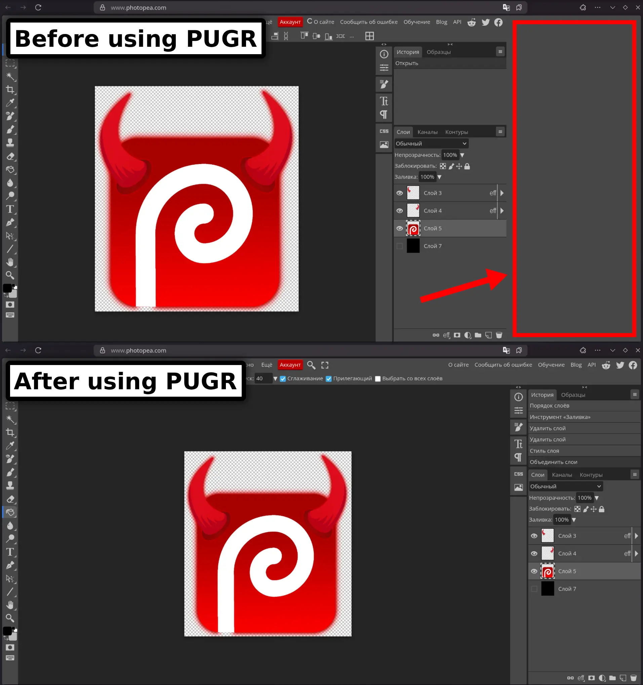

# PUGR (Photopea Useless Gap Remover)

Tampermonkey script **that removes the large and useless right margin in the Photopea interface** — the space reserved for ads that remain even when using an AdBlock. 
The script expands the workspace and makes the interface more user-friendly.

## Using
1. Install [Tampermonkey](https://www.tampermonkey.net/index.php) in your browser
2. Click 

-----
